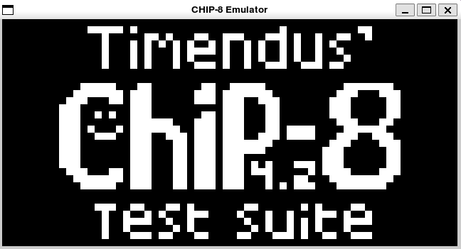
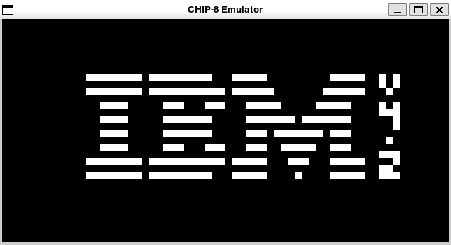
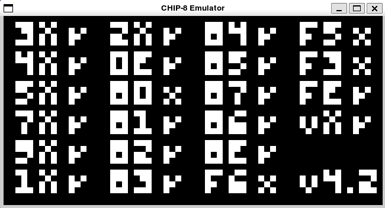
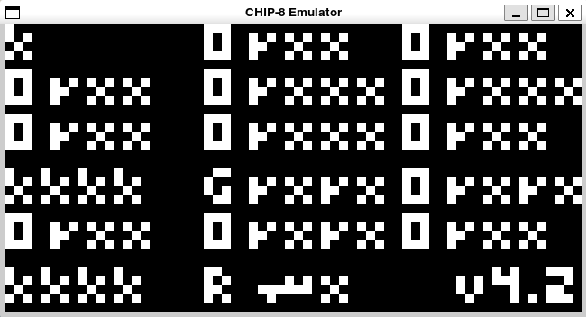

# Simple C++ CHIP-8 Emulator
## C++ Project
C++ project for CHIP-8 emulator:
- source/chip8 code for CHIP-8 instructions
- source/manager code for SDL display and keyboard manager
- source/emulator code for CHIP-8 emulator using previous libraries
- tests/cip8-tests code for testing chip8 library
- extern/googletest-1.17.0 
- extern/raylib-5.5

If your include/libs are not in standard locations expected by compiler/linker, modify CMakeLists.txt to use your paths:
```
include_directories(/opt/local/include)
link_directories(/opt/local/lib)
```
To build:
```
make build
```
For testing 
```
make test
```
Test Opcode0xcxkk testing random number generator will fail due to machines randomness, modify test value 0x20 (works for my machine) by the value generated by your machine.
```
1: /Users/mohaila/Desktop/Workspace/chip8/tests/chip8-tests/main.cpp:460: Failure
1: Expected equality of these values:
1:   cpu.registers[0x5]
1:     Which is: 'f' (102, 0x66)
1:   0x20
1:     Which is: 32
```
In this case the generated random number is 0x66.

For code coverage
```
make coverage
```
## Running
For testing CHIP-8 emulator, use a ROM from roms folder or your own ROM
```
./buildir/bin/chip8-emulator roms/1-chip8-logo.ch8
```
## Screenshoots



